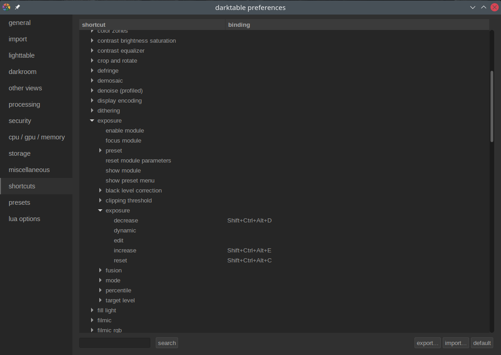

# MIDI-macro

I got a brand-new MIDI controller with plenty of potentiometer knobs, and figured that they'd be quite useful also for
some image processing tasks, like fine-tuning the exposure and sharpness. I didn't find any direct support for this
(though some might be [coming up in 3.8](https://github.com/darktable-org/darktable/issues/5063)) but I found
[this project](https://github.com/vipul-sharma20/midi-macro) in github. So I decided to practice some golang and
improve that to fit my needs.

First I configured [darktable](https://www.darktable.org/) to have some obscure shortcut keys for the
operations I needed, for example like so:



I.e. modifier Shift+Ctrl+Alt and any keys possible. For each slider to manipulate, I used 3 keys: increase, decrease
and reset.

Then I configured the expanded midi-macro tool which you can find here with setup instructions:
* [MIDI-macro in github](https://github.com/tfager/midi-macro)

Here's some example configuration:
```yaml
port: "Launchkey MK3 25:Launchkey MK3 25 MIDI 1"
keys:
    - name: "42"
      type: "button"
      task: "xdotool,key,ctrl+alt+shift+c"

    # Knobs
    - name: "23"
      type: "knob"
      task: "keyPress"
      key_up: "ctrl+alt+shift+e"
      key_down: "ctrl+alt+shift+d"
```

So the reset button is considered a "key" (just on-off action), which invokes the
[xdotool](https://github.com/jordansissel/xdotool) to relay the keypress to an application. The increase/decrease
keys are configured as a knob (which does use the xdotool internally as well), so that you can specify which keypress
is sent when knob is turned either up or down.

And the result works like this:
<iframe width="615" height="346" src="https://www.youtube.com/embed/47Lfbmzs3FU" title="YouTube video player" frameborder="0" allow="accelerometer; autoplay; clipboard-write; encrypted-media; gyroscope; picture-in-picture" allowfullscreen></iframe>
